# Segmented Zone Monitoring POC

POC lokal untuk monitoring multi-zone dengan Docker Compose.

Stack ini mensimulasikan:

- `Zone A` dan `Zone B`
- `Core Monitoring`
- HAProxy sebagai mock BIG-IP
- Prometheus per-zone dan central Prometheus
- Grafana dashboard
- Blackbox exporter untuk availability check
- Elasticsearch, Logstash, Kibana untuk demo application logs
- Go agent untuk infrastructure metrics
- Go demo app untuk application metrics dan logs

## Prerequisites

Pastikan sudah tersedia:

- Go
- Docker Desktop
- Docker Compose


## Cara Menjalankan

Project ini punya beberapa mode sesuai opsi arsitektur:

- Opsi 1: `Single Prometheus + Agent + ELK`
- Opsi 2: `Federated Prometheus + Agent + ELK`
- Opsi 3: `Datadog (SaaS)` — metrics + logs + APM ke cloud Datadog (butuh `DD_API_KEY`)
- Opsi Tracing: `Federated + Grafana Tempo` — distributed tracing on-prem (OpenTelemetry)
- Opsi AI: `Ollama` — ringkasan log otomatis berbasis LLM lokal (on-prem)
- Semua sekaligus: `up-all` — stack + Tempo + Ollama dalam satu project

Semua memakai port host yang sama (`3000`, `9090`, `9200`, dan lainnya), jadi jalankan salah satu opsi saja dalam satu waktu.

Pilih salah satu cara jalan:

| Cara jalan | Command start | Command stop | Toggle error |
| --- | --- | --- | --- |
| Federated via Makefile | `make up-federated` | `make down-federated` | `make errors-on-federated` / `make errors-off-federated` |
| Single via Makefile | `make up-single` | `make down-single` | `make errors-on-single` / `make errors-off-single` |
| Datadog via Makefile | `make up-datadog` | `make down-datadog` | - |
| Tracing (Tempo) via Makefile | `make up-tracing` | `make down-tracing` | `make errors-on` / `make errors-off` |
| Ollama (AI) via Makefile | `make up-ollama` | `make down-ollama` | `make errors-on` / `make errors-off` |
| Semua (all) via Makefile | `make up-all` | `make down-all` | `make errors-on-all` / `make errors-off-all` |
| Manual Docker Compose | `docker compose -f deploy/docker-compose.yml up --build` | `docker compose -f deploy/docker-compose.yml down` | `make errors-on` / `make errors-off` |

### Opsi 1 - Single Prometheus

Mode ini menjalankan satu Prometheus central yang scrape agent dan demo app lintas zona melalui HAProxy mock BIG-IP.

```bash
make up-single
```

Stop Opsi 1:

```bash
make down-single
```

### Opsi 2 - Federated Prometheus

Mode ini menjalankan Prometheus per-zone, lalu Prometheus central mengambil metrik dari setiap zone Prometheus melalui endpoint federation.

```bash
make up-federated
```

Stop Opsi 2:

```bash
make down-federated
```

### Opsi 3 - Datadog (SaaS)

Mode ini mengganti paradigma dari self-hosted (Opsi 1/2) menjadi SaaS: Datadog Agent berjalan per-zona, mengumpulkan metrik (via OpenMetrics), log aplikasi, dan trace (APM via OTLP), lalu mem-push semuanya ke cloud Datadog. Tidak ada Prometheus/ELK pada opsi ini.

Beda mendasar dengan Opsi 1/2:

- Data **tersimpan di cloud Datadog** (region lewat `DD_SITE`), bukan on-prem. Tidak ada opsi penyimpanan on-premise, jadi opsi ini **tidak cocok untuk server tanpa internet**.
- **Logs dan APM** hanya aktif saat **free trial** atau **Paid Plan**.

Prasyarat: akun Datadog + API key. Isi di `.env`:

```bash
cp .env.example .env
```

```dotenv
DD_API_KEY=<api-key-kamu>
DD_SITE=us5.datadoghq.com
```

> `DD_SITE` harus cocok dengan region akunmu (mis. `datadoghq.com`, `us5.datadoghq.com`, `ap1.datadoghq.com`), kalau tidak data tidak masuk.

Jalankan:

```bash
make up-datadog
make ps-datadog
make logs-datadog
make down-datadog
```

Cek di Datadog (sesuai region `DD_SITE`):

- **Infrastructure > Host Map**: `node-zone-a`, `node-zone-b`
- **Metrics > Explorer**: `poc.system_cpu_usage_percent`, filter `zone:zone-a`
- **Logs > Search**: `service:payments-api`
- **APM > Traces / Services**: filter `env:poc`

Detail lengkap (limitasi free tier, on-premise, setup APM/tracing) ada di [docs/opsi-3-datadog.md](docs/opsi-3-datadog.md) dan [docs/opsi-tracing.md](docs/opsi-tracing.md).

### Opsi Tracing - Grafana Tempo

Menjalankan stack federated + **Grafana Tempo** untuk distributed tracing on-prem. demo-app diinstrumentasi OpenTelemetry; trace dikirim ke Tempo via OTLP dan tampil di panel Grafana **"Recent Traces from Tempo"** (Explore juga bisa). Satu request `/api/demo` menghasilkan waterfall berlapis: `GET /api/demo` → `process-demo` → `authorize` / `validate-request` / `query-database` → `db.query` / `call-downstream`.

```bash
make up-tracing
make down-tracing
```

Instrumentasi bersifat opt-in (aktif lewat `OTEL_EXPORTER_OTLP_ENDPOINT`), jadi opsi lain tidak terpengaruh. Detail di [docs/opsi-tracing.md](docs/opsi-tracing.md).

### Opsi AI - Ollama (Log Insights)

Menambahkan ringkasan log otomatis berbasis LLM lokal (**Ollama**). Service `insight` membaca log error dari Elasticsearch secara periodik, merangkum dengan model `llama3.2:3b`, lalu menyimpan hasilnya kembali ke Elasticsearch untuk ditampilkan di panel Grafana **"AI Log Insights (Ollama)"**. Seluruhnya berjalan on-prem/offline, gratis, tanpa API key.

```bash
make up-ollama       # stack + ollama + insight (model di-pull otomatis saat pertama)
docker compose --env-file .env -p monitoring-poc-ollama -f deploy/docker-compose.yml -f deploy/docker-compose.ollama.yml exec ollama ollama list
curl -XPOST http://localhost:8090/summarize   # picu ringkasan langsung
make logs-ollama
make down-ollama
```

Pada first run, tunggu sampai model `llama3.2:3b` muncul di `ollama list`. Kalau `/summarize` dipanggil saat pull model masih berjalan, Ollama akan membalas `model not found`.

LLM tidak pernah di hot path (hanya batch/on-demand, model kecil CPU-friendly), jadi tidak membebani agent maupun demo-app. Detail di [docs/opsi-ollama.md](docs/opsi-ollama.md).

Opsional, ringkasan AI bisa **diteruskan ke Datadog** sekaligus (selain ke Elasticsearch): jika `DD_API_KEY` di `.env` terisi, service `insight` mengirim ringkasan ke Datadog Logs HTTP intake (lihat di **Logs → Search**, filter `source:insight`). Catatan: ini mengirim data ke cloud, jadi hanya cocok bila server terhubung internet.

### Semua sekaligus - `make up-all`

Menjalankan semua pilar dalam satu project: metrics (Prometheus) + logs (ELK) + **tracing (Tempo)** + **AI insights (Ollama)**. Cocok untuk demo di mana semua panel Grafana terisi sekaligus.

```bash
make up-all          # stack + Tempo + Ollama + insight
docker compose --env-file .env -p monitoring-poc-all -f deploy/docker-compose.yml -f deploy/docker-compose.tracing.yml -f deploy/docker-compose.ollama.yml exec ollama ollama list
make errors-on-all   # (opsional) generate 5xx untuk bahan trace error + ringkasan AI
make down-all
```

Stop semua project opsi:

```bash
make down
```

### Manual Docker Compose Opsi 2

Dari root repo, jalankan:

```bash
docker compose -f deploy/docker-compose.yml up --build
```

Tunggu beberapa menit sampai semua service up

Cek status container:

```bash
docker compose -f deploy/docker-compose.yml ps
```

Jalan di background:

```bash
docker compose -f deploy/docker-compose.yml up --build -d
```

## URL Akses

| Komponen | URL | Keterangan |
| --- | --- | --- |
| Grafana | http://localhost:3000 | Dashboard utama |
| Central Prometheus | http://localhost:9090 | Metrics hasil federation |
| Zone A Prometheus | http://localhost:9091 | Metrics lokal Zone A |
| Zone B Prometheus | http://localhost:9092 | Metrics lokal Zone B |
| HAProxy mock BIG-IP | http://localhost:8404 | Status proxy antar-zone |
| Elasticsearch | http://localhost:9200 | Storage demo application logs |
| Kibana | http://localhost:5601 | Opsional untuk cek logs |

## Screenshots

### Grafana Dashboard

URL:

```text
http://localhost:3000
```

File screenshot:

```text
docs/screenshots/grafana-dashboard.png
```

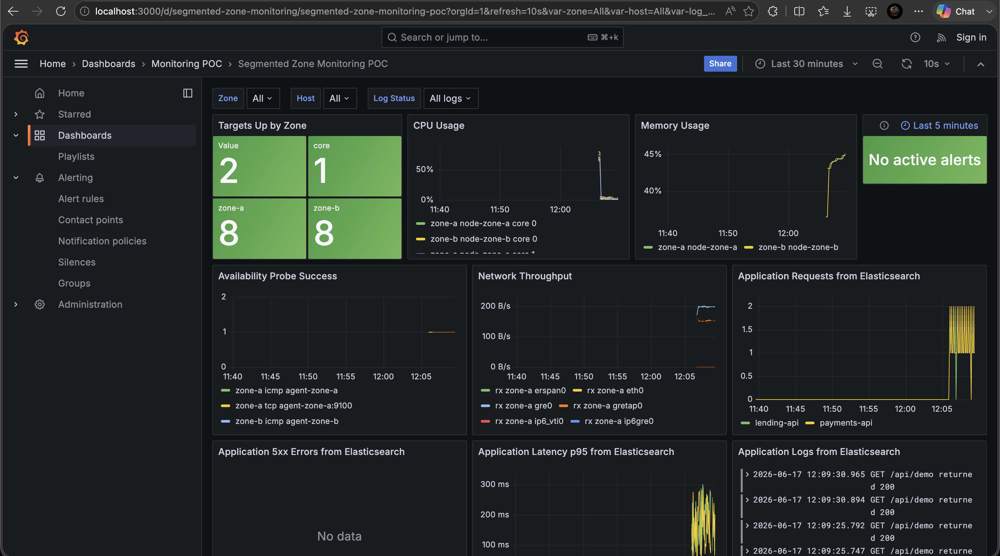

Dashboard Grafana menjadi tampilan utama untuk monitoring. Screenshot ini menunjukkan status target per zone, CPU, memory, availability probe, network throughput, application request dari Elasticsearch, latency p95, dan log aplikasi.

### Zone A Prometheus Targets

URL:

```text
http://localhost:9091/targets
```

File screenshot:

```text
docs/screenshots/prometheus-zone-a-targets.png
```

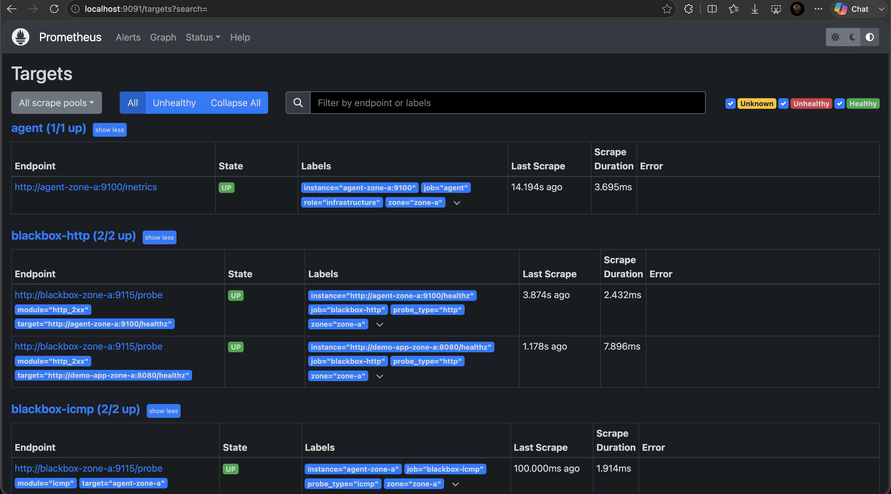

Prometheus Zone A melakukan scrape target lokal di `zone-a`. Screenshot ini memperlihatkan agent, demo app, dan Blackbox Exporter probe dalam status `UP`.

### Zone B Prometheus Targets

URL:

```text
http://localhost:9092/targets
```

File screenshot:

```text
docs/screenshots/prometheus-zone-b-targets.png
```

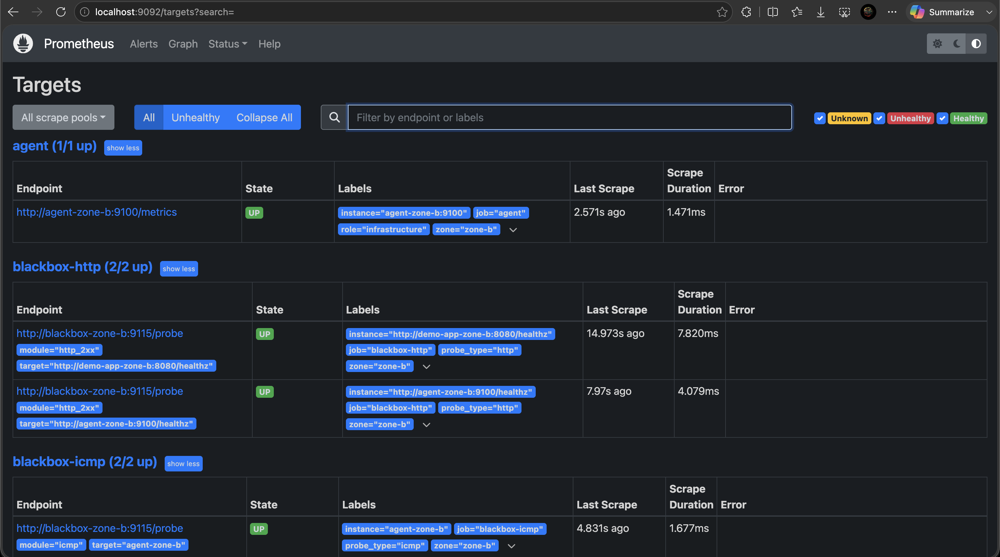

Prometheus Zone B melakukan scrape target lokal di `zone-b`. Ini menunjukkan pola yang sama seperti Zone A, tetapi untuk agent dan demo app di zona berbeda.

### HAProxy Status

URL:

```text
http://localhost:8404
```

File screenshot:

```text
docs/screenshots/haproxy-status.png
```

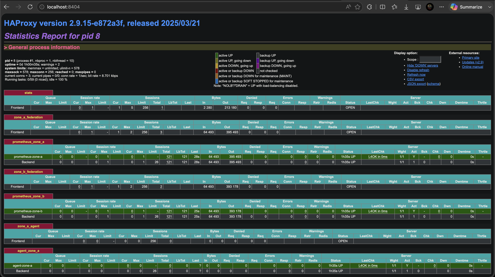

HAProxy dipakai sebagai mock BIG-IP. Screenshot ini menunjukkan frontend dan backend yang menjembatani traffic antara `core_net`, `zone_a_net`, dan `zone_b_net`.

### Elasticsearch Logs

URL:

```text
http://localhost:9200/demo-app-logs-*/_search?pretty&size=5
```

File screenshot:

```text
docs/screenshots/elasticsearch-logs.png
```

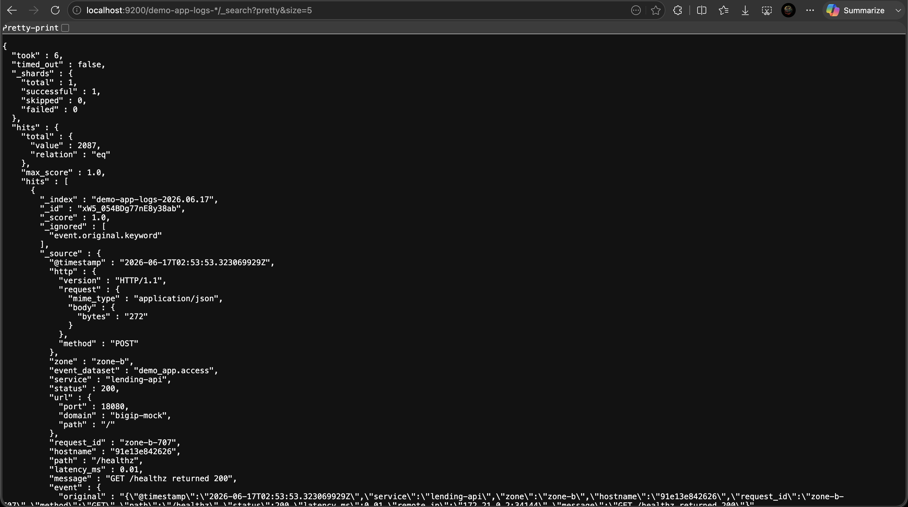

Endpoint Elasticsearch dipakai untuk mengecek raw log yang sudah masuk dari demo app. Data ini menjadi sumber application logs dan application metrics di Grafana.

### Kibana Discover

URL:

```text
http://localhost:5601/app/discover
```

File screenshot:

```text
docs/screenshots/kibana-discover.png
```

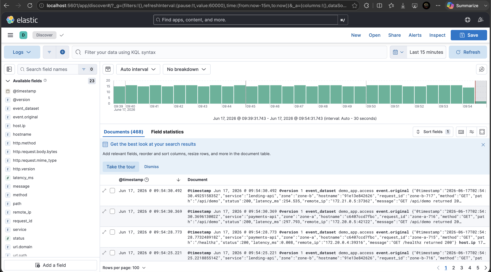

Kibana bersifat opsional untuk eksplorasi log. Screenshot ini memperlihatkan index log aplikasi dan field seperti `service`, `zone`, `status`, `latency_ms`, dan `message`.

Login Grafana:

```text
username: admin
password: admin
```

## Screenshots Datadog (Opsi 3)

Screenshot untuk Opsi 3 dilihat di aplikasi Datadog (sesuai region `DD_SITE`, contoh di bawah memakai `us5.datadoghq.com`). Jalankan `make up-datadog` lebih dulu dan tunggu 1-2 menit sampai data masuk.

### Datadog Infrastructure

URL:

```text
https://us5.datadoghq.com/infrastructure
```

File screenshot:

```text
docs/screenshots/datadog-infrastructure.png
```

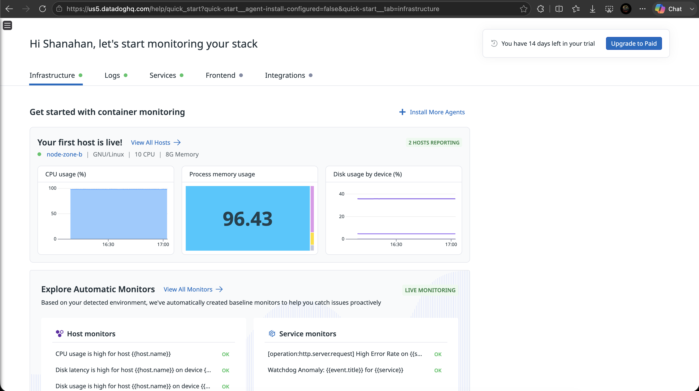

Tab Infrastructure menunjukkan host yang melaporkan data lewat Datadog Agent per-zona (`node-zone-a`, `node-zone-b`) beserta CPU, memory, dan disk. Banner di kanan atas menandakan akun masih dalam masa free trial 14 hari.

### Datadog Logs

URL:

```text
https://us5.datadoghq.com/logs
```

File screenshot:

```text
docs/screenshots/datadog-logs.png
```

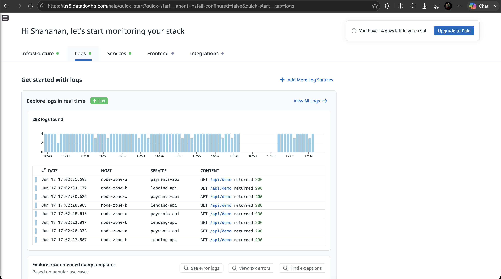

Log aplikasi demo app dikumpulkan Datadog Agent dari stdout container (JSON) dan di-parse menjadi atribut seperti `host`, `service`, dan `content`. Terlihat request `GET /api/demo` dari `payments-api` dan `lending-api`.

### Datadog APM

URL:

```text
https://us5.datadoghq.com/apm/traces
```

File screenshot:

```text
docs/screenshots/datadog-apm.png
```

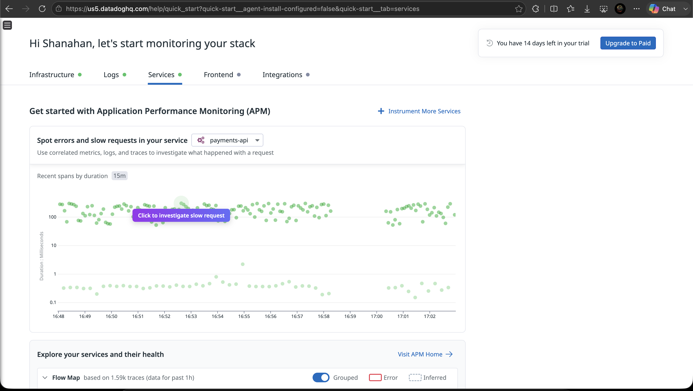

APM menampilkan distributed tracing dari demo app yang diinstrumentasi OpenTelemetry (dikirim via OTLP ke Datadog Agent), termasuk sebaran span per durasi untuk service `payments-api`. Filter dengan `env:poc`.

### Datadog Dashboard - Infrastructure Metrics

URL:

```text
https://us5.datadoghq.com/dashboard/lists
```

File screenshot:

```text
docs/screenshots/datadog-dashboard-infra.png
```

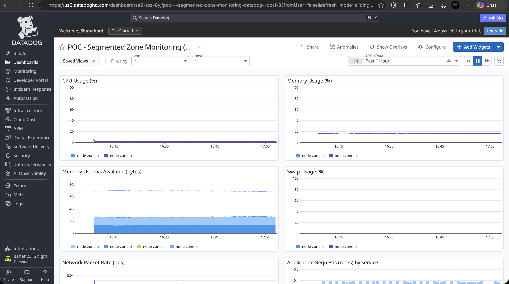

Dashboard "POC - Segmented Zone Monitoring" hasil import `deploy/datadog/dashboard.json`, menampilkan CPU, memory, swap, dan network per host (`node-zone-a`, `node-zone-b`) dengan filter `zone` dan `host`.

### Datadog Dashboard - Application Metrics

File screenshot:

```text
docs/screenshots/datadog-dashboard-app.png
```

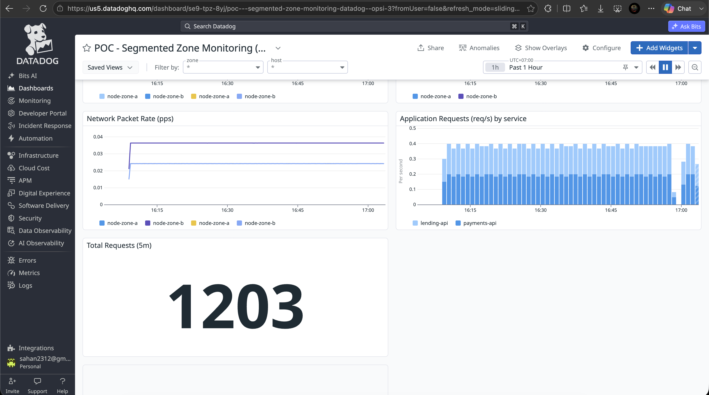

Bagian bawah dashboard yang sama menampilkan network packet rate, application requests per service, dan total request (panel `query_value`) dari metrik `poc.demo_app_requests.count`.

> Logs dan APM hanya aktif saat free trial / paket berbayar.

## Cara Melihat Dashboard

1. Buka Grafana:

   ```text
   http://localhost:3000
   ```

2. Login dengan `admin` / `admin`.

3. Buka menu `Dashboards`.

4. Pilih folder:

   ```text
   Monitoring POC
   ```

5. Buka dashboard:

   ```text
   Segmented Zone Monitoring POC
   ```

Dashboard ini menampilkan:

- Infrastructure metrics: CPU, memory, network
- Availability monitoring: HTTP, TCP, ICMP probe status
- Application metrics dari Elasticsearch logs: request count, 5xx errors, latency p95
- Application logs: log aplikasi dari Elasticsearch
- Grafana alerting untuk CPU, memory, availability probe, dan application 5xx errors

Dashboard punya filter:

- `Zone`: pilih `All`, `zone-a`, atau `zone-b`.
- `Host`: pilih `All`, `node-zone-a`, atau `node-zone-b`. Filter ini berlaku untuk metrik maupun log aplikasi karena agent dan demo app dalam satu zona memakai identitas host yang sama.
- `Log Status`: pilih `All logs` atau `5xx errors only`.

## Toggle Synthetic Error

Secara default demo app tidak membuat error palsu:

```text
DEMO_ERROR_RATE=0
```

Pakai command sesuai cara menjalankan stack.

Kalau start manual dengan `docker compose -f deploy/docker-compose.yml up`:

```bash
make errors-on
make errors-off
```

Kalau start dengan `make up-federated`:

```bash
make errors-on-federated
make errors-off-federated
```

Kalau start dengan `make up-single`:

```bash
make errors-on-single
make errors-off-single
```

Saat error dinyalakan, default rate-nya:

```text
zone-a payments-api: 15%
zone-b lending-api: 10%
```

Rate bisa diubah saat menyalakan:

```bash
DEMO_ERROR_RATE_ZONE_A=0.05 DEMO_ERROR_RATE_ZONE_B=0.02 make errors-on
```

Nilai local bisa disimpan di `.env`:

```bash
cp .env.example .env
```

Untuk memicu in-app alert Grafana dengan cepat:

```bash
DEMO_ERROR_RATE_ZONE_A=1 DEMO_ERROR_RATE_ZONE_B=1 make errors-on
```

Tunggu 1-2 menit, lalu buka:

```text
http://localhost:3000
```

Masuk ke menu:

```text
Alerting > Alert rules
```

Rule yang harus berubah menjadi alerting:

```text
Application 5xx errors detected
```

Dashboard juga punya panel:

```text
Alert Notifications
```

Panel ini berfungsi seperti badge notifikasi. Nilainya menunjukkan jumlah 5xx error dalam 5 menit terakhir. Panel berubah merah jika nilainya lebih dari 0.

Setelah selesai demo alert:

```bash
make errors-off
```

Setelah error dimatikan, data 5xx lama masih bisa muncul di Grafana sampai keluar dari time range. Pakai `Last 5 minutes` untuk melihat kondisi terbaru.

## Kumpulan Contoh Query Prometheus

Buka Central Prometheus:

```text
http://localhost:9090
```

Coba query berikut:

```promql
system_cpu_usage_percent
system_memory_usage_percent
system_memory_used_bytes
system_memory_available_bytes
system_swap_usage_percent
system_network_receive_bytes_total
system_network_transmit_bytes_total
system_network_receive_packets_total
system_network_transmit_packets_total
system_network_receive_errors_total
system_network_transmit_errors_total
system_network_receive_packets_per_second
system_network_transmit_packets_per_second
system_network_receive_errors_per_second
system_network_transmit_errors_per_second
probe_success
demo_app_requests_total
demo_app_errors_total
demo_app_request_duration_seconds_count
```

Query per zone:

```promql
sum by (zone) (up)
sum by (zone, probe_type) (probe_success)
system_cpu_usage_percent{scope="overall"}
system_cpu_usage_percent{scope="core"}
sum by (zone, service) (rate(demo_app_requests_total[1m]))
```

## Cara Cek Logs

Cek logs aplikasi dari Elasticsearch:

```bash
curl "http://localhost:9200/demo-app-logs-*/_search?pretty&size=5"
```

Query application error dari Elasticsearch:

```bash
curl "http://localhost:9200/demo-app-logs-*/_search?pretty&q=status:%5B500%20TO%20599%5D&size=5"
```

Kalau data belum muncul, tunggu 1-2 menit. Demo app akan membuat traffic otomatis lewat service `traffic-zone-a` dan `traffic-zone-b`.


## Cara Stop

Stop semua service:

```bash
docker compose -f deploy/docker-compose.yml down
```

Stop dan hapus volume data lokal:

```bash
docker compose -f deploy/docker-compose.yml down -v
```

## Build Binary

Ada **dua varian agent** (kontrak metrik/endpoint identik, beda toolchain & target OS):

| Varian | Sumber | Toolchain | Target OS | Output build |
| --- | --- | --- | --- | --- |
| **Agent utama** (gopsutil) | `cmd/agent/` | Go 1.20 | Linux (lama→baru) + **Windows Server 2008 R2 → terbaru** | `bin/agent`, `bin/linux-amd64/agent`, `bin/windows-amd64/agent.exe` |
| **Agent legacy 2008** (hand-rolled) | `agent-2008/` | Go 1.10.8 | **Windows Server 2008 non-R2** (Vista-class) | `bin/windows-2008/agent-2008-win{32,64}.exe` |

Detail: [`docs/opsi-windows-2008.md`](docs/opsi-windows-2008.md).

```bash
make test            # go1.20 test ./...
make build           # host
make build-linux     # agent utama -> linux/amd64
make build-windows   # agent utama -> windows/amd64 (jalan di Server 2008 R2+)
make build-agent-2008 # agent legacy -> windows 386+amd64 (Server 2008 non-R2, via Docker)
```

Untuk membuat bundle offline berisi image Docker dan binary static Linux/Windows:

```bash
scripts/offline-bundle.sh
```

## Benchmark & Stress Test

Mengukur dua hal: agent ringan, dan backend sanggup ~500 server. Detail metodologi,
query, dan hasil ada di [`docs/benchmark.md`](docs/benchmark.md). Butuh `go1.20`
(`go install golang.org/dl/go1.20@latest && go1.20 download`) dan Docker.

Footprint agent (Lapisan 1):

```bash
make bench-agent                                  # biaya per-scrape (ns/op, allocs/op)
make build && AGENT_ZONE=bench ./bin/agent &      # start agent
make bench-k6-agent                               # k6 load /metrics (p95/p99, RPS)
```

Kapasitas metrics 500 server (Lapisan 2, Avalanche → Prometheus bench):

```bash
make bench-fleet                                  # ~100k series; buka http://localhost:9094
make bench-scale SCALE=20                          # cross-check agent nyata via docker_sd
make bench-fleet-down                             # stop + bersih
```

Kapasitas log 500 server (Lapisan 3, k6 → demo-app → ELK):

```bash
make up-federated
make bench-k6-logs LOG_RATE=200                   # traffic ke /api/demo
curl 'localhost:9200/_cat/indices?v'              # pertumbuhan index untuk ekstrapolasi sizing
```
